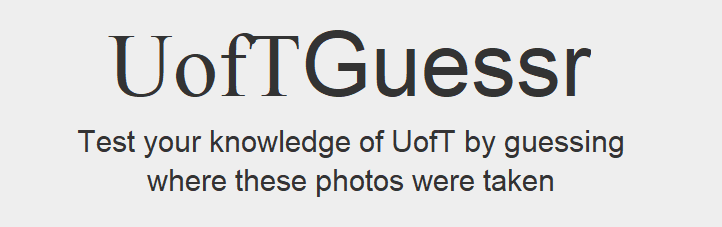
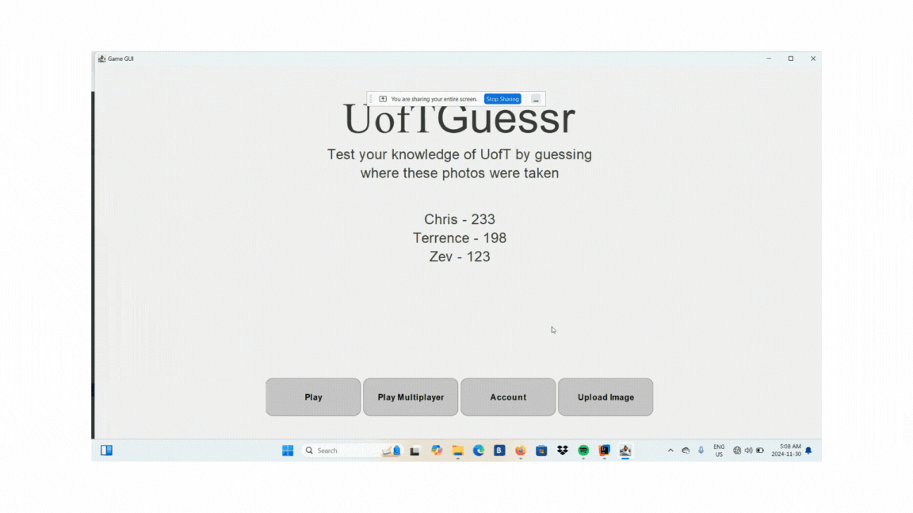
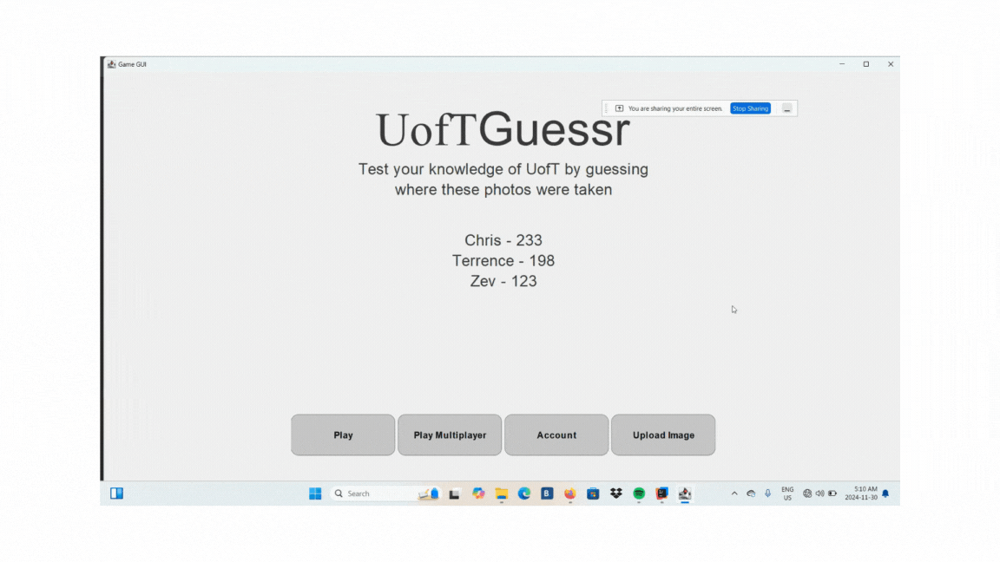
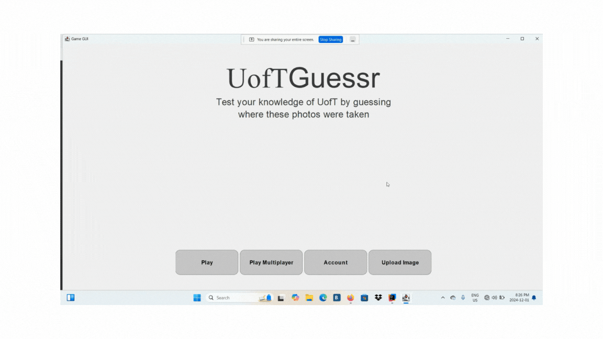

Looking to test your knowledge of the UofT St George Campes? UofTGeoGuessr is the game for you!  
UofTGeoGuessr provides a fun interactive experience in which players can challenge their friends to see who knows their campus the best.

---

## Authors and Contributors

Terrence Allder  
Aksshatt Bariar  
Zev Godfrey  
Rithvik Sunil  
Kristopher Zhao

_The project started from a lab code developed by CSC207 team._

---
## Table of Contents

1. [Project Purpose](#project-purpose)
2. [Features of the Software](#features-of-the-software)
3. [Installation Instructions](#installation-instructions)
4. [Usage Guide](#usage-guide)
5. [License](#license)
6. [Feedback](#feedback)
7. [Contributions](#contributions)

---

## Project Purpose
Our project is a game that tests people's knowledge of the UofT campus in a fun and engaging way.
This game provides two modes: a social multiplayer mode, where users can compete among friends, and a solo mode for users who want a more peaceful experience.
University life can be intense, so we wanted to help alleviate the pressure by embracing the wonderful architecture around UofT and promoting the discovery of ne places on campus.

We wanted to create a fun experience, accessible to all students, faculty and staff at the University of Toronto's St George Campus. Our app was designed to reinforce a sense of belonging and community among both students and faculty.

---

## Features of the Software

**Sign up / Log in** features enable users to associate their gameplay and progress to an account.  
**Change account information** feature allows users to change the email associated with their account, update their username, log out, and delete their account.  
**Check Stats** feature lets users see how many points they have accumulated and how many games they have played.   
**Upload Image** feature allows users to upload a picture of a location on the UofT campus and specify the location where the picture was taken.  
**Interactive Guessing** core feature of our application. Users can click on a map to select the exact location they believe a given picture was taken at.  
**Multiplayer Game** feature allows users to play against each other and see who gets the most points. The images generated are the same for both players for fairness.

All features are showcased in our [Usage Guide](#usage-guide) section.

---

## Installation Instructions
see a full installation demonstration [here](https://drive.google.com/file/d/1q2dFMJ-VL90z7lydPBLKgowK4025Bxwd/view?usp=sharing)
to see how to install java and our app

### Software Requirements
- **Operating System**: This application runs on any operating system (Windows, macOS, Linux).
- **Java Version**:
    - Recommended: [Latest version of Java](https://www.oracle.com/java/technologies/downloads/).
    - Minimum Requirement: Java version 22 or later.

### Instructions
To set up and run the project, follow these steps:

1. **Download the Project**
    - Visit the [Release Page](https://github.com/Zev-G/csc207project/releases/tag/0.1-b.1).
    - Download the file named `csc207project_jar.zip`.

2. **Install Java**
    - Ensure that Java is installed on your system. If it is not installed, download and install the [latest version of Java](https://www.oracle.com/java/technologies/downloads/). Any version 22 or later is sufficient.
    - To verify your Java installation, open a terminal or command prompt and run:
      ```bash
      java -version
      ```
    - This should display the Java version. If the command fails, ensure Java is properly installed and added to your system's PATH.

3. **Extract the ZIP File**
    - Locate the downloaded file `csc207project_jar.zip` and extract its contents to a directory of your choice.
    - Inside the extracted directory, you should see a file named `csc207project.jar`.

4. **Run the Application**
    - Open a terminal or command prompt.
    - Navigate to the directory where `csc207project.jar` is located, or provide the full path to the file.
    - Run the application using the following command:
      ```bash
      java -jar path_to_csc207project.jar
      ```
      Replace `path_to_csc207project.jar` with the actual path to the `csc207project.jar` file.


### Common Issues and Troubleshooting

- **'java' is not recognized as an internal or external command**
    - **Cause**: Java is not installed or not added to the system's PATH.
    - **Solution**: Add Java to the PATH environment variable.
        - **Windows**:
          ```cmd
          setx PATH "%PATH%;C:\Program Files\Java\jdk-22\bin"
          ```
          Replace `C:\Program Files\Java\jdk-22\bin` with the actual path to the `bin` directory of your Java installation.
        - **Linux/macOS**:
          ```bash
          export PATH=$PATH:/path/to/java/bin
          ```
          Replace `/path/to/java/bin` with the actual path to the `bin` directory of your Java installation.
        - Verify the installation by running:
          ```bash
          java -version
          ```

- **Unsupported Java Version**
    - **Cause**: A Java version older than 22 is installed.
    - **Solution**: Check your installed version:
      ```bash
      java -version
      ```
      Expected output:
      ```plaintext
      java version "22.0.1"
      Java(TM) SE Runtime Environment (build 22.0.1+9)
      Java HotSpot(TM) 64-Bit Server VM (build 22.0.1+9, mixed mode)
      ```
      If the version is older, download and install the latest version from the [Java Downloads page](https://www.oracle.com/java/technologies/downloads/).

- **Permission Denied**
    - **Cause**: Lack of execution permissions on Unix-based systems.
    - **Solution**: Grant execution permissions to the `.jar` file:
      ```bash
      chmod +x csc207project.jar
      ```
      Then run the application:
      ```bash
      java -jar csc207project.jar
      ```
      If necessary, use `sudo`:
      ```bash
      sudo java -jar csc207project.jar
      ```

- **Running the Application from a Different Directory**
    - **Solution**: Provide the full path to the `.jar` file:
      ```bash
      java -jar /absolute/path/to/csc207project.jar
      ```
      For example:
      ```bash
      java -jar C:\Users\YourUsername\Downloads\csc207project.jar
      ```

- **Checking the PATH Environment Variable**
    - **Solution**: Print the current PATH variable to confirm if Java is included:
        - **Windows**:
          ```cmd
          echo %PATH%
          ```
        - **Linux/macOS**:
          ```bash
          echo $PATH
          ```
        - Look for the path to Java (e.g., `/usr/local/java/jdk-22/bin`). If it’s missing, add it as described above.


### Additional Notes
- This application is cross-platform and works on Windows, macOS, and Linux.
- For additional support, refer to the [Java Installation Guide](https://www.oracle.com/java/technologies/javase-install.html).


---

## Usage Guide
When first launching the app, you will be prompted to log in or sign up. To create an account, enter a username, password, and email address. After logging in, you will be directed to the main page where the app's functionalities are accessible.  


On the main page, you will find navigation buttons:
- **Play**: Start a solo game.
- **Multiplayer**: Challenge another player in multiplayer mode.
- **Account**: Manage your account details and view your statistics.
- **Upload Image**: Add your own photos to the game.

To play a solo game, click the Play button to start immediately. The game consists of 10 rounds of location guessing. For each round, you will see a picture and use an interactive map to select the location you believe the picture was taken. Confirm your guess by clicking the Guess button. Be mindful of the timer, as the game ends if it runs out before all rounds are completed. Points are awarded based on how close your guess is to the actual location. At the end of the game, you can return to the main menu with the Home button or view a game summary with the Summary button.  


In multiplayer mode, you and your opponent each enter your usernames to start the game. Gameplay is the same as solo mode, but at the end, you can see both players' scores and the winner based on total points.  


In the Account section, you can view your account details, delete your account, and check your statistics such as total points, games played, and correct guesses.  


To upload your own images, click the Upload Image button. Add a photo of a UofT location, select the corresponding location on the interactive map, and upload it. Your image will then be available for use in both solo and multiplayer games.  
.

---
## License

This project is licensed under the terms of the [GNU General Public License v3.0](LICENSE).

You are free to use, modify, and distribute this software as outlined in the license. See the full license text in the [LICENSE](LICENSE) file for more details.

---

## Feedback

The UofTGuessr team always wants to improve this project. If you have any questions, worries or suggestions please follow this link to
[create an issue](https://github.com/Zev-G/csc207project/issues) to describe ay problems or share any suggestions.

Any and all feedback is accepted and appreciated as long as it is polite and non-abusive to the members of our team.

We will do our best to get back to review your feedback and get back to you within 10 business days.

---

## Contributions

In accordance with the philosophy of our license, we do not accept outside contributions to this project. However, as mentioned earlier, we welcome your feedback and suggestions.

We kindly ask that you respect the hard work our team has put into creating this application and refrain from modifying the code in any way.
